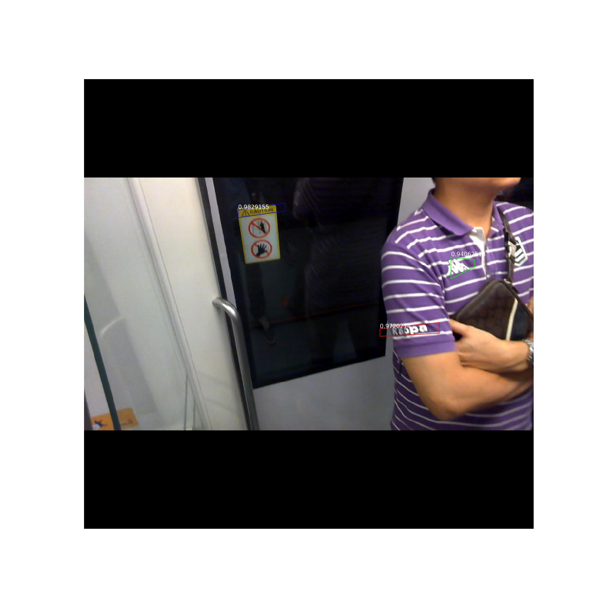
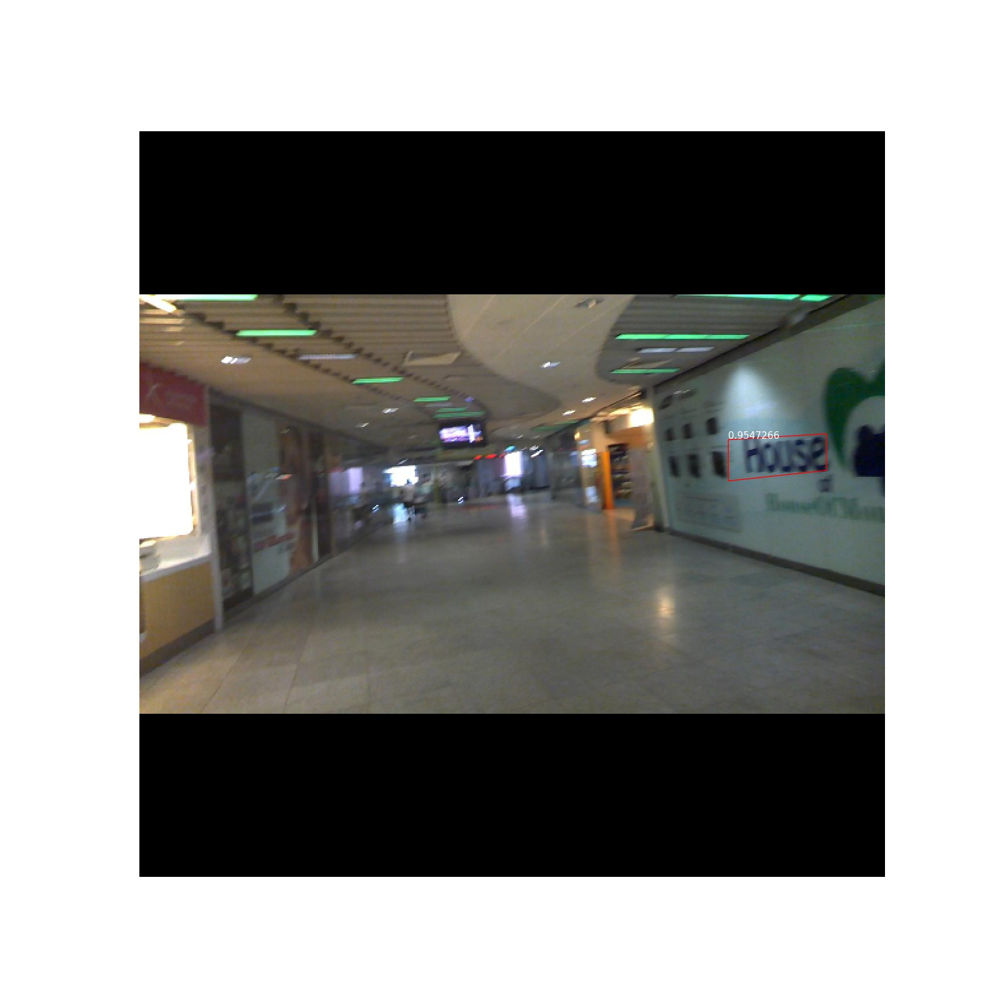
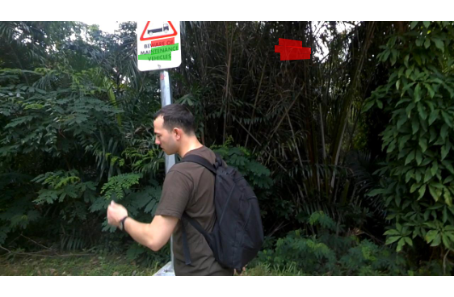
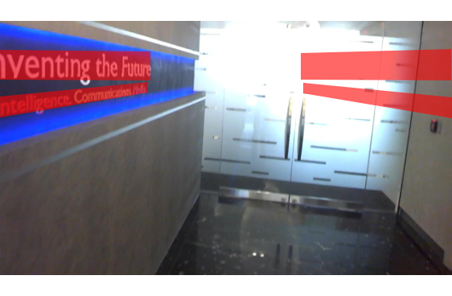
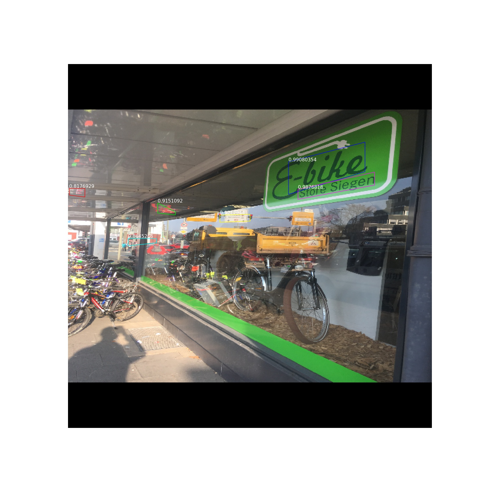
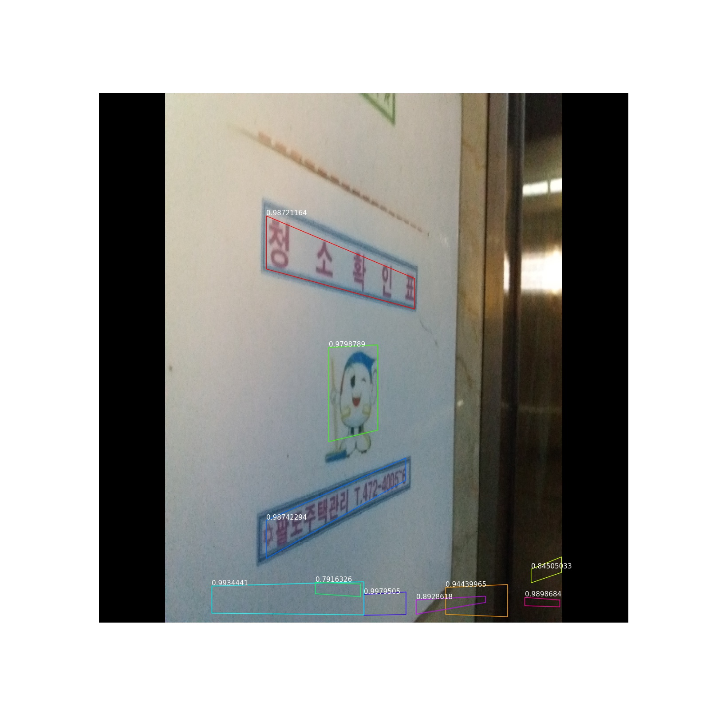
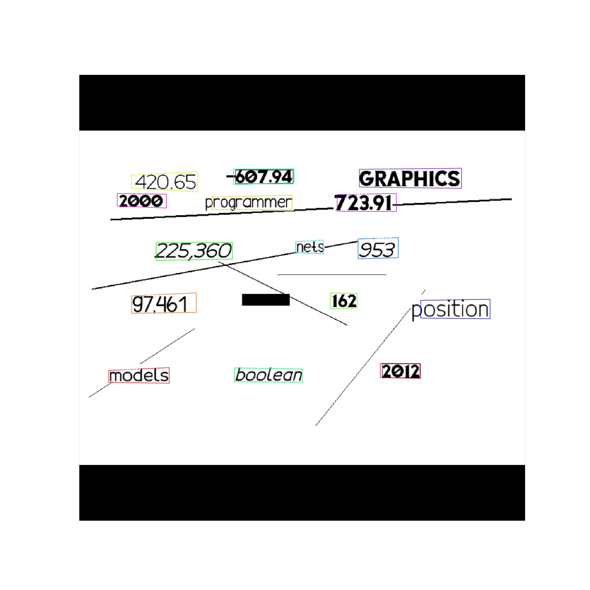

# keras-ctpn

[TOC]

1. [说明](#说明)
2. [预测](#预测)
3. [训练](#训练)
4. [例子](#例子)<br>
   4.1 [ICDAR2015](#ICDAR2015)<br>
   4.1.1 [带侧边改善](#带侧边改善)<br>
   4.1.2 [不带带侧边改善](#不带侧边改善)<br>
   4.1.3 [做数据增广-水平翻转](#做数据增广-水平翻转)<br>
   4.2 [ICDAR2017](#ICDAR2017)<br>
   4.3 [其它数据集](#其它数据集)
5. [toDoList](#toDoList)
6. [总结](#总结)

## 说明

​         本工程是keras实现的[CPTN: Detecting Text in Natural Image with Connectionist Text Proposal Network](https://arxiv.org/abs/1609.03605) . 本工程实现主要参考了[keras-faster-rcnn](https://github.com/yizt/keras-faster-rcnn) ; 并在ICDAR2015和ICDAR2017数据集上训练和测试。

​         工程地址: [keras-ctpn](https://github.com/yizt/keras-ctpn)

​         cptn论文翻译:[CTPN.md](https://github.com/yizt/cv-papers/blob/master/CTPN.md)

**效果**：

​        使用ICDAR2015的1000张图像训练在500张测试集上结果为：Recall: 37.07 % Precision: 42.94 % Hmean: 39.79 %;
原文中的F值为61%；使用了额外的3000张图像训练。

**关键点说明**:

a.骨干网络使用的是resnet50

b.训练输入图像大小为720*720; 将图像的长边缩放到720,保持长宽比,短边padding;原文是短边600;预测时使用1024*1024

c.batch_size为4, 每张图像训练128个anchor,正负样本比为1:1;

d.分类、边框回归以及侧边改善的损失函数权重为1:1:1;原论文中是1:1:2

e.侧边改善与边框回归选择一样的正样本anchor;原文中应该是分开选择的

f.侧边改善还是有效果的(注:网上很多人说没有啥效果)

g.由于有双向GRU，水平翻转会影响效果(见样例[做数据增广-水平翻转](#做数据增广-水平翻转))

h.随机裁剪做数据增广，网络不收敛


## 预测

a. 工程下载

```bash
git clone https://github.com/yizt/keras-ctpn
```


b. 预训练模型下载

​    ICDAR2015训练集上训练好的模型下载地址：[ctpn.h5](https://pan.baidu.com/s/1XeQN0H1_FdTPBwH1GDlW_w) 提取码：k7yu 

c.修改配置类config.py中如下属性

```python
	WEIGHT_PATH = '/tmp/ctpn.h5'
```

d. 检测文本

```shell
python predict.py --image_path image_3.jpg
```

## 评估

a. 执行如下命令,并将输出的txt压缩为zip包
```shell
python evaluate.py --weight_path /tmp/ctpn.140.h5 --image_dir /opt/dataset/OCR/ICDAR_2015/test_images/ --output_dir /tmp/output_2015/
```

b. 提交在线评估
   将压缩的zip包提交评估，评估地址:http://rrc.cvc.uab.es/?ch=4&com=mymethods&task=1

## 训练

a. 训练数据下载
```shell
#icdar2013
wget http://rrc.cvc.uab.es/downloads/Challenge2_Training_Task12_Images.zip
wget http://rrc.cvc.uab.es/downloads/Challenge2_Training_Task1_GT.zip
wget http://rrc.cvc.uab.es/downloads/Challenge2_Test_Task12_Images.zip
```

```shell
#icdar2015
wget http://rrc.cvc.uab.es/downloads/ch4_training_images.zip
wget http://rrc.cvc.uab.es/downloads/ch4_training_localization_transcription_gt.zip
wget http://rrc.cvc.uab.es/downloads/ch4_test_images.zip
```

```shell
#icdar2017
wget -c -t 0 http://datasets.cvc.uab.es/rrc/ch8_training_images_1~8.zip
wget -c -t 0 http://datasets.cvc.uab.es/rrc/ch8_training_localization_transcription_gt_v2.zip
wget -c -t 0 http://datasets.cvc.uab.es/rrc/ch8_test_images.zip
```


b. resnet50与训练模型下载

```shell
wget https://github.com/fchollet/deep-learning-models/releases/download/v0.2/resnet50_weights_tf_dim_ordering_tf_kernels_notop.h5
```


c. 修改配置类config.py中，如下属性

```python
	# 预训练模型
    PRE_TRAINED_WEIGHT = '/opt/pretrained_model/resnet50_weights_tf_dim_ordering_tf_kernels_notop.h5'

    # 数据集路径
    IMAGE_DIR = '/opt/dataset/OCR/ICDAR_2015/train_images'
    IMAGE_GT_DIR = '/opt/dataset/OCR/ICDAR_2015/train_gt'
```

d.训练

```shell
python train.py --epochs 50
```


## 例子

### ICDAR2015

#### 带侧边改善


#### 不带侧边改善




#### 做数据增广-水平翻转



### ICDAR2017






### 其它数据集



## toDoList

1. 侧边改善(已完成)
2. ICDAR2017数据集训练(已完成)
3. 检测文本行坐标映射到原图(已完成)
4. 精度评估(已完成)
5. 侧边回归,限制在边框内(已完成)
6. 增加水平翻转(已完成)
7. 增加随机裁剪(已完成)


### 总结

1. ctpn对水平文字检测效果不错
2. 整个网络对于数据集很敏感;在2017上训练的模型到2015上测试效果很不好；同样2015训练的在2013上测试效果也很差
3. 推测由于双向GRU，网络有存储记忆的缘故？在使用随机裁剪作数据增广时网络不收敛，使用水平翻转时预测结果也水平对称出现
